Path Tracer: Nights of the Final Project I
======================

Sarah Forcier 
58131867

Lens-based camera 
--------

| -----------	| :----------: 			| :-------: 			| :-------: 			|
| Fical Length 	| 30 					| 30 					| 32 					|
| Lens Radius 	| 0.5 					| 1.5 					| 1.5 					|
| Image 	 	| 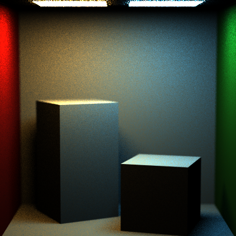 | 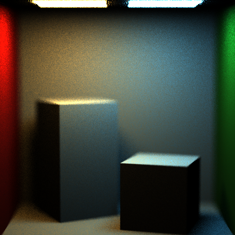 	| 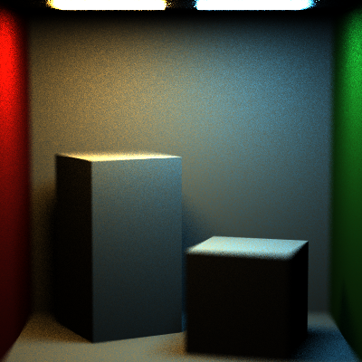 |

Constructive Solid Geometry
----------------
### Intersection
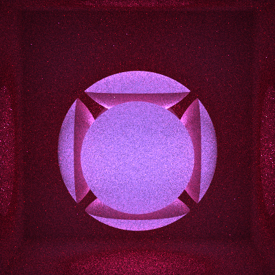

### Difference
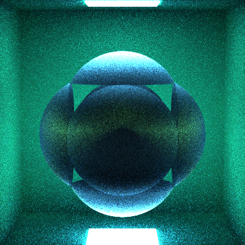

### Union
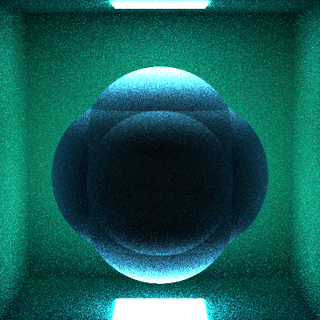

De Noising
-----------

### Full Lighting Integrator

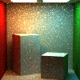 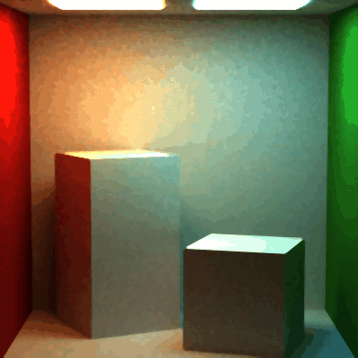

### Direct Lighting Integrator

 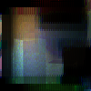

### Naive Integrator

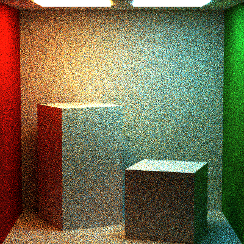 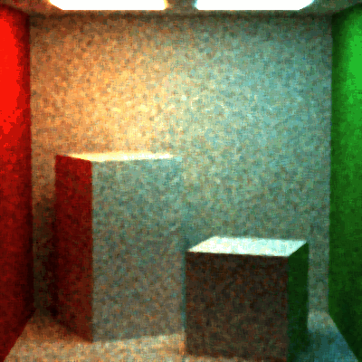

