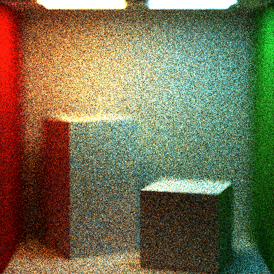
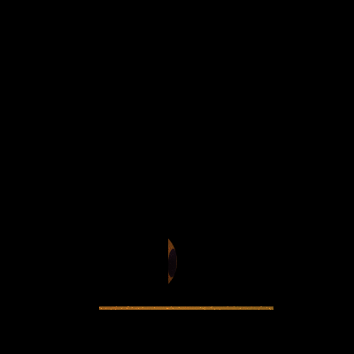
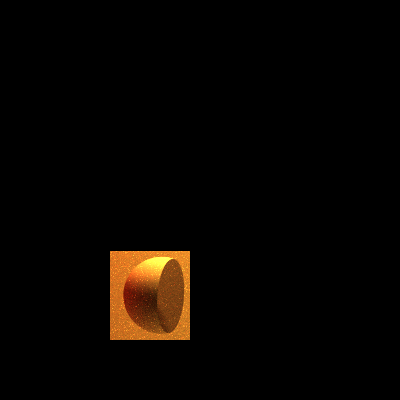
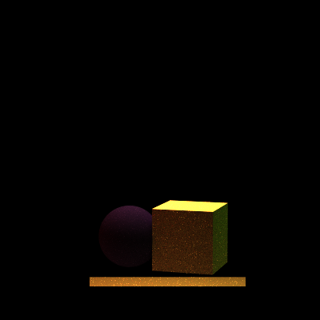
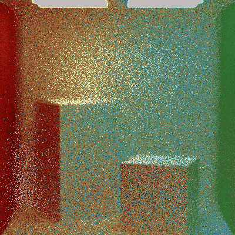

Path Tracer: Nights of the Final Project I
======================

Sarah Forcier 
58131867

Lens-based camera 
--------

Constructive Solid Geometry
----------------
### Intersection

### Difference

### Union

De Noising
-----------
I implemented 1D K-means compression based on hue, and it looks terrible. I am implementing a new denoiser based on this paper: 

Removing the Noise in Monte Carlo Rendering with General Image Denoising Algorithms

